# Собачая еда

### [Сайт с собачей едой](https://gor241.github.io/dog3/)

## Screenshots:
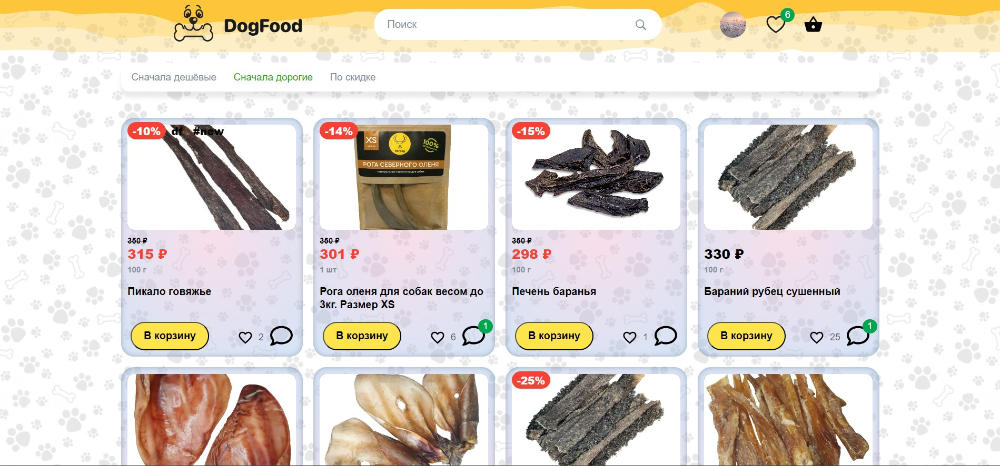 | 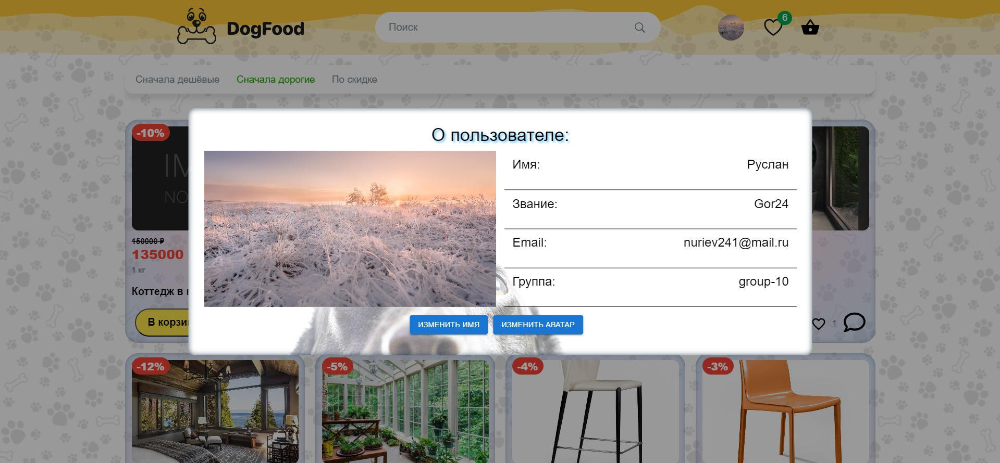
--- | ---
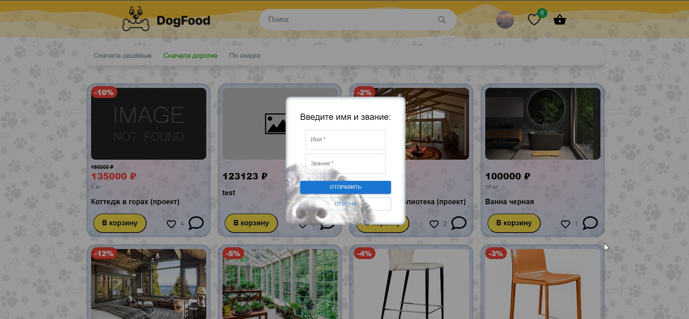 | 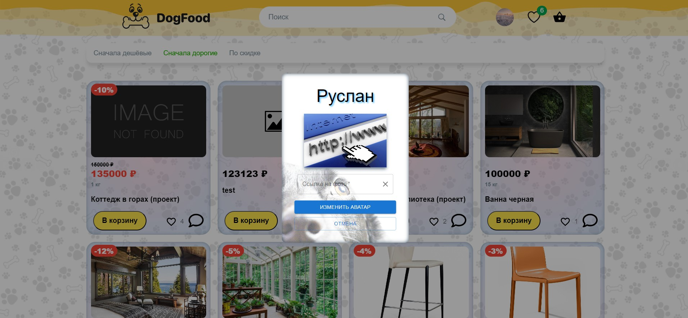
--- | ---
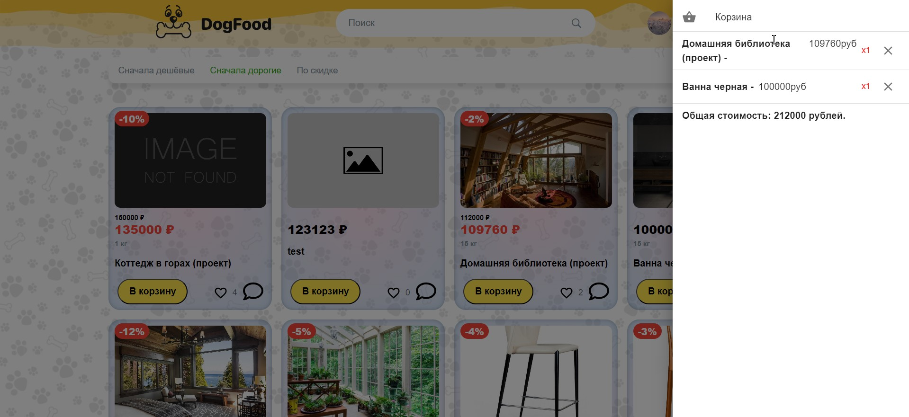 | 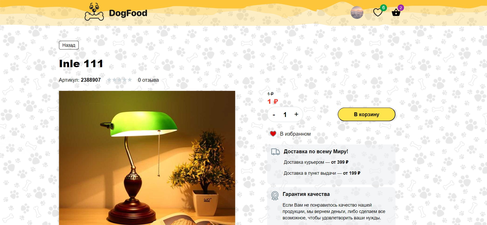
--- | ---
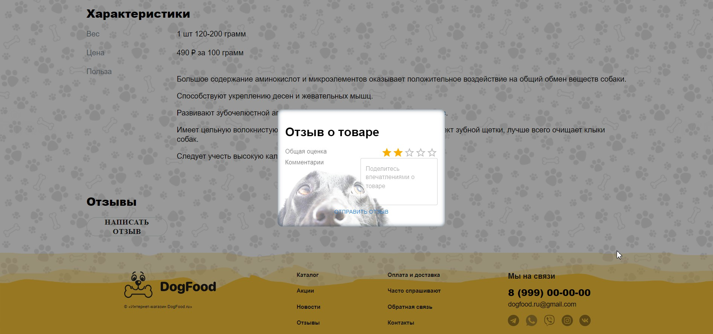 | 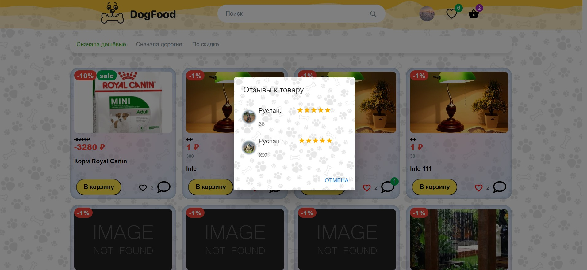
--- | ---
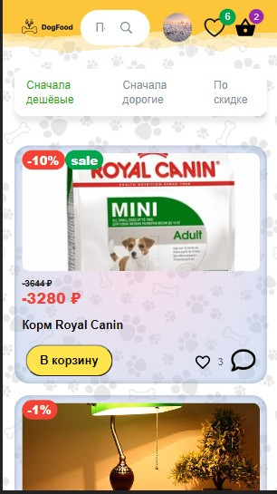 | 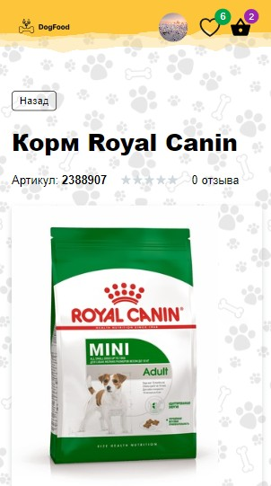
--- | ---
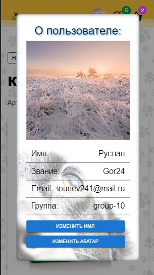 | 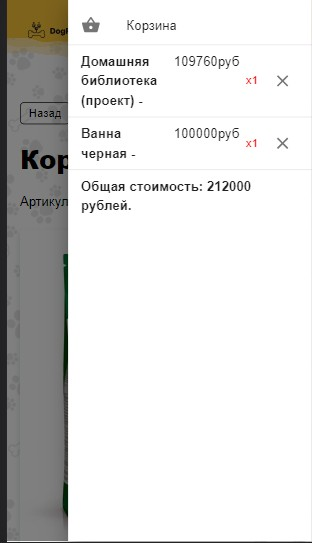

## Функциональность:
- SPA с собачей едой
- Отработка взаимодействия с кастомным серверным api
- Упраляемые компоненты
- Вход/регистрация на сайт
- Функционал 'Забыл пароль' ( мы вводим email от
своего аккаунта. Система отправит на нашу почту пароль, мы его введём с новым паролем
и произведём вход.)
- В шапке нам становится доступен поиск среди постов и иконка избранное
- Добавление и удаления карточек 
- Добавление и удаление лайков/отзывов
- При нажатии на иконку избранное, мы переходим
на страницу 'Избранное' (все посты, на которые мы поставили лайк)
- При нажатии на пост, мы попадаем на страницу поста
- На странице поста имеется возможность добавлять отзыва
- На главной странице постов реализована сортировка
- На странице постов реализована серверная пагинация, с возможностью выбора
кол ва постов за раз
- Реализована страница 404
- Структура проекта реализована в соответствии с рекомендациями
разработчиков React
- Сторонний функционал:
  - React toolkit набор инструментов, который упрощает и автоматизирует работу с Redux
  - Router ( routes,route,navlink ) маршрутизация на стороне клиента
  - MUI (библиотека Material UI) готовые компоненты и иконки
  - React Hook Form библиотека для управления формами в React
  - Classnames способ работы с CSS классами

## Работа с проектом

`npm i` - Установка модулей

`npm start` - Cтарт проекта 

`npm run deploy` - Собрать проект в build и выставить на github pages
